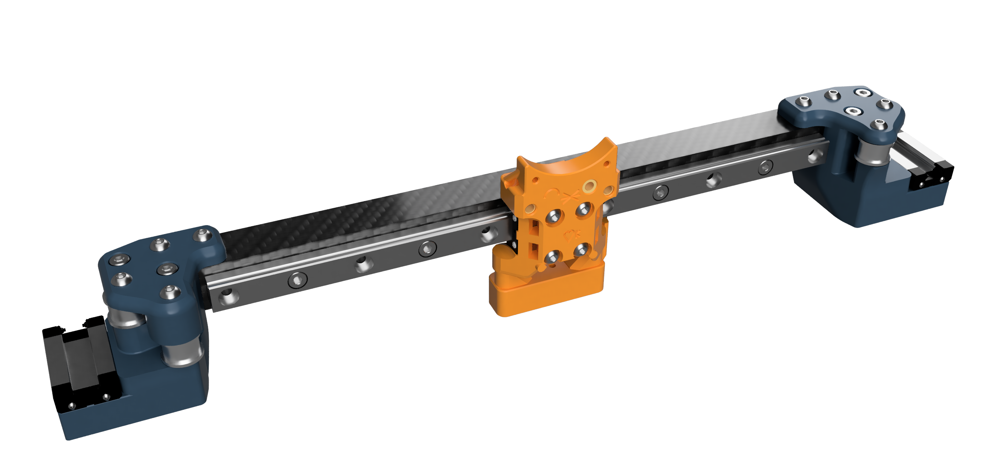

# Carbon-Salad
Carbon fiber gantry member for the [Salad Fork](https://github.com/Yeriwyn/Salad_Fork), adaptable to the [Micron](https://github.com/hartk1213/Micron), inspired by aTinyShellScript's [CarbonFiberX V2.4 mod](https://github.com/aTinyShellScript/VoronUsers/tree/CarbonFiberX/printer_mods/aTinyShellScript/CarbonFiberX)

***This is an early, untested work in progress, and is subject to change!***

## BOM:
Required: *(click dropdown for respective build)*

    

    Salad Fork 150mm³
    

Component | Quantity | Notes
--- | :-: | ---
M3x12 BHCS | 4 | Top XY joints
M3x20 SHCS | 2 | Bottom XY joints
M3x10 SHCS | 5 | Rail mounting
[M3 flanged lock nuts](https://www.amazon.com/gp/product/B07XXRLMBB/)| 5 | Rail mounting
[Misumi HNSQ3-3 square nuts](https://us.misumi-ec.com/vona2/detail/110300465710) | 6 | Tube inserts
[15x15x12.5 carbon square tube](https://dronebuildz.com/products/fahrenheit-15x15mm-square-carbon-tube-12-5-wall) | 1 | Don't buy shitty tube

    

    Salad Fork 120mm³
    

Component | Quantity | Notes
--- | :-: | ---

    

    Micron 120mm³
    

Component | Quantity | Notes
--- | :-: | ---

  

    Required tools
  

  
Item | Notes
--- | ---
Mask or Respirator | Carbon dust is very toxic
Safety Goggles | Safety squints not acceptable
Drill Press | Hand drill not advised
Carbide Drill Bit(s) | Do not use regular bits
Hex Drivers |
Saw or Dremel |
Fine Grit Sandpaper | To clean up edges
Blue Painters Tape | Helps prevent delamination 

